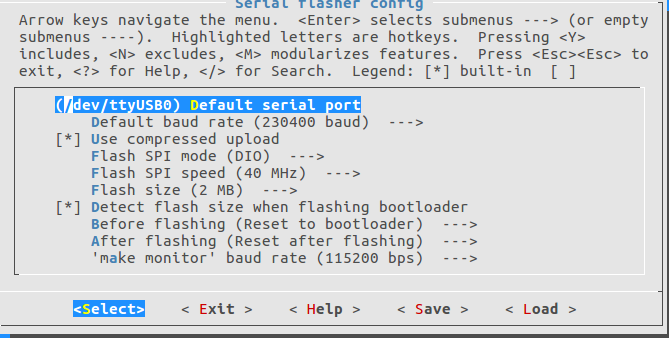
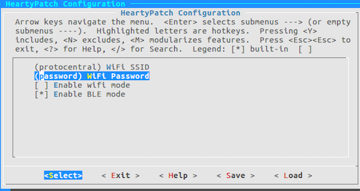
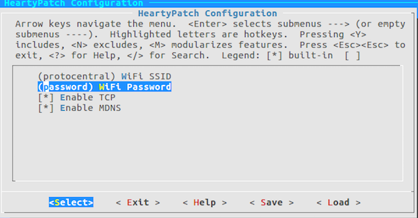
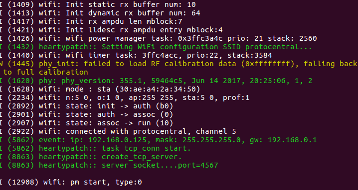

# Compiling HeartyPatch Firmware

The firmware for the HeartyPatch's on-board Espressif ESP32 chip uses the [esp-idf framework](https://github.com/espressif/esp-idf)
 for development. You will need to install and configure the following components to setup a development environment:

### The Xtensa ESP32 toolchain
Please make sure download the toolchain from the links on [this page of the Espressif Site](http://esp-idf.readthedocs.io/en/v2.1/get-started/index.html#standard-setup-of-toolchain)

### The v2.1 release of esp-idf
[Download and unzip the ESP-IDF v2.1 from this link](https://github.com/espressif/esp-idf/releases/download/v2.1/esp-idf-v2.1.zip)
### Supporting software such as Python and pyserial

**Please make sure all of the above tools are properly installed before proceeding.**

**The current version of the HeartyPatch code compiles well and performs well only with v2.1 of the ESP-IDF and version 1.22.0-61-gab8375a-5.2.0 of the Xtensa toolchain.**

Setup guides for these components are available on the [ESP-IDF documentation site](https://esp-idf.readthedocs.io/en/v2.1/get-started/index.html).

You can then clone our [Github repository](https://github.com/Protocentral/protocentral_heartypatch) of code for the ESP32:

`git clone https://github.com/Protocentral/protocentral_heartypatch.git`

[or download a zip file of the latest master branch](https://github.com/Protocentral/protocentral_heartypatch/archive/master.zip).

Download this zip file, rename it to whatever you want to. Change to this directory and then start building.

The folder "heartypatch-ble" in the "Firmware" contains the  code of preloaded firmware on the heartypatch board, which calculates RR interval, heart rate and time domain parameters for hrv analysis and sends them through BLE.

Now that you have the code and ready to build, you will need to configure the build options for heartypatch through menuconfig utility:

* Open the terminal and navigate to the folder which contains the heartypatch code 	
* Start the project configuration utility **menuconfig**     		
`make menuconfig`

* Configure your serial port under *Serial flasher config -> Default serial port*

* Use the *Heartypatch configuration* to enable ble mode.

BLE mode at this time does not support ECG stream since max30003 sensor is configured for rtor detectoin. By enabling the wifi, you may get hr and rr values through TCP in the heartypatch GUI. For ECG strem you may use the heartypatch-stream-tcp code [protocentral-heartypatch/firmware/heatypatch-stream-tcp]

* Navigate to component config -> esp32-specific ->main XTAL frequency and select 26 Mhz as the board crystal

* save the configuration by selecting `<save>` and close menuconfig

Run the makefile (assuming previous steps are done correctly):

`make` or `make -j5`

To flash the firmware on to the board, just use:

`make flash`

If the flashing is successful, you should see something similar to the below screen:

**ECG STREAMING**

The folder `heartypatch-stream-tcp` contains the code for streaming ECG.

Before flashing this code, enable wifi, TCP and mdns through `makemenuconfig` similar to the process described in the previous section.

* Start makemenuconfig and navigate to *Heartypatch configuration*, set your wifi ssid and password, enable mdns and TCP:

* Configure the serial port under Serial flasher config -> Default serial port
* Navigate to *Component config -> esp32-specific ->main XTAL frequency* and select 26 MHz as the board crystal

Run the makefile (assuming previous steps are done correctly):

`make` or `make -j5`

To flash the firmware on to the board, just use:

`make flash`

If the flashing is successful, you should see something similar to the below screen:

You can open the IDF monitor to see the debug messages by using the command:

`make monitor`

Once the heartypatch is connected with the wifi, open the gui from the project folder and you should be able see the ECG stream.  

More information about this process and the ESP32 framework is available in the [ESP32 Get Started Guide](http://esp-idf.readthedocs.io/en/latest/get-started/).
